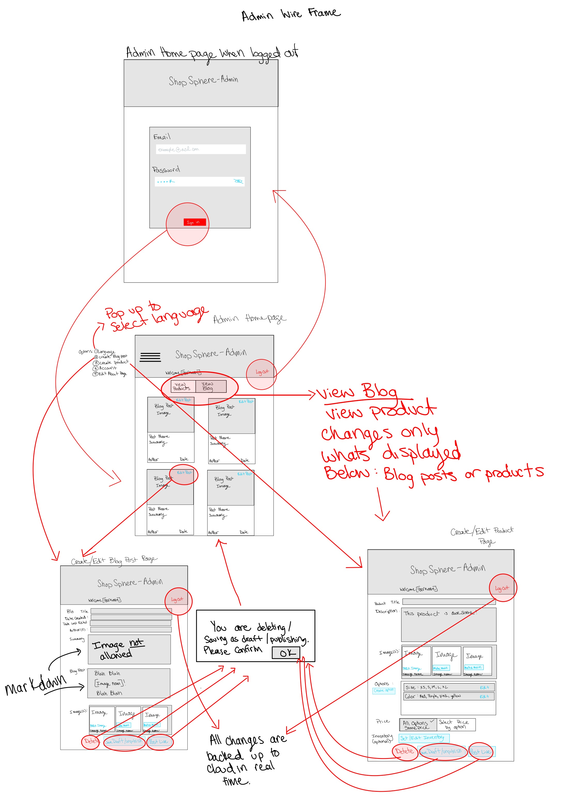

# Project Setup Working Document 

## Project Overview
This project aims to develop an e-commerce website builder with blogging functionality for small businesses. It leverages React for the front-end and Flask for the back-end, with payment integration and checkout experience using Stripe.

Total estimated monthly cost: **$0 - $20**

## Low Fidelity Mockups 

### User Customer Story

1. User Flow Diagram: 

2. User Home Page:  

3. Product Inspection: 

4. Blog Catalog Page: 

5. Blog Post View Page:  

### Admin Store Owner Story 

6. Admin User Flow Diagram: 

7. Admin Log Out Home Page:  

8. Admin Log In Home Page: 

9. Product Edit Page:  

10. Blog Post Edit Page: 

## Useful Links
- [Azure Pricing Calculator](https://azure.microsoft.com/en-us/pricing/calculator/)
- [Docker Documentation](https://docs.docker.com/)
- [Stripe API Reference](https://stripe.com/docs/api)
- [Strapi Documentation](https://strapi.io/documentation/)
